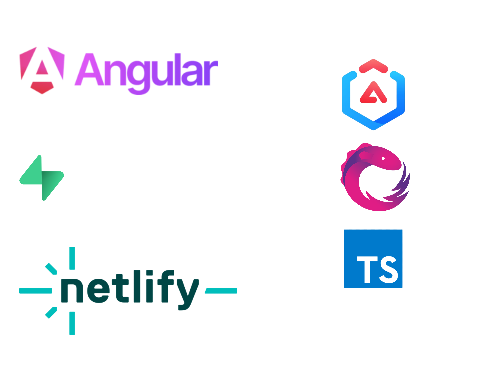

# Petit suís

In general terms, the primal experiment of asking "_what if an Angular application was 100% reactive?_".  
All declarative, full [RxJS](https://rxjs.dev/) usage, no regrets.

> DISCLAIMER - i18n and l10n may come soon.

